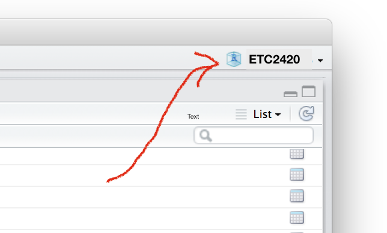

```{r, echo = FALSE, message = FALSE, warning = FALSE, warning = FALSE}
knitr::opts_chunk$set(
  message = FALSE,
  warning = FALSE,
  error = FALSE, 
  collapse = TRUE,
  comment = "#",
  fig.height = 4,
  fig.width = 8,
  fig.align = "center",
  cache = FALSE
)
```

## Getting up and running with the computer

- R and RStudio
- Projects
- RMarkdown
- Basic functions

## R is ...

* __Free__ to use
* __Extensible__
    * Over 8500 user contributed add-on packages currently on CRAN!
* __Powerful__
    * With the right tools, get more work done, faster.
* __Flexible__
    * Not a question of _can_, but _how_.
* __Frustrating__
    * Flexibility comes at a cost (easy to shoot yourself in the foot!).

```{r, eval = FALSE, echo = FALSE}
# devtools::install_github("metacran/crandb")
# pkgs <- crandb::list_packages(limit = 999999)
# length(pkgs)
# [1] 8654
```

## RStudio is ...

[From Julie Lowndes](http://jules32.github.io/resources/RStudio_intro/):  

<blockquote>
<b>If R were an airplane, RStudio would be the airport</b>, providing many, many supporting services that make it easier for you, the pilot, to take off and go to awesome places. Sure, you can fly an airplane without an airport, but having those runways and supporting infrastructure is a game-changer.
</blockquote>

## The RStudio IDE

1. Source editor: 
  - Docking station for multiple files, 
  - Useful shortcuts ("Knit"), 
  - Highlighting/Tab-completion, 
  - Code-checking (R, HTML, JS), 
  - Debugging features  
2. Console window: 
  - Highlighting/Tab-completion, 
  - Search recent commands
3. Other tabs/panes: 
  - Graphics, 
  - R documentation, 
  - Environment pane, 
  - File system navigation/access, 
  - Tools for package development, git, etc

## Projects

Creating a project helps organise work. For this unit, I have created a project on my laptop called `ETC2420`. 



## Exercise 1

Create a project for this unit, in the directory. (Be sure that you open this at the start of each lab. Generally it is a good idea NOT TO SAVE THE WORKSPACE when you close a project for the day.)

* File -> New Project -> Existing Directory -> Empty Project

## Exercise 2

Open a new Rmarkdown document. You are going to want to call it `MYLab1` (it will automatically get the file extension `.Rmd`) when you save it. 

* File -> New File -> R Markdown -> OK -> Knit HTML


## What is R Markdown?

- From the [R Markdown home page](http://rmarkdown.rstudio.com/):

- R Markdown is an authoring format that enables easy creation of dynamic documents, presentations, and reports from R. 
- It combines the core syntax of __markdown__ (an easy-to-write plain text format) __with embedded R code chunks__ that are run so their output can be included in the final document. 
- R Markdown documents are fully reproducible (they can be automatically regenerated whenever underlying R code or data changes).

## Exercise 3

Look at the text in the `MYLab1.Rmd` document. 

- What is R code? 
- How does `knitr` know that this is code to be run?
- Using the RStudio IDE, work out how to run a chunk of code. Run this chunk, and then run the next chunk.
- Using the RStudio IDE, how do you run just one line of R code?
- Using the RStudio IDE, how do you highlight and run multiple lines of code?
- What happens if you try to run a line that starts with "```{r}"? Or try to run a line of regular text from the document?
- Using the RStudio IDE, `knit` the document into a Word document.

## Getting data

Data can be found in R packages

```{r}
library(dplyr)
data(economics, package = "ggplot2")
# data frames are essentially a list of vectors
glimpse(economics)
```

These are not usually kept up to date but are good for practicing your analysis skills on.


Or in their own packages

```{r}
library(gapminder)
glimpse(gapminder)
```

I primarily use the `readr` package for reading data now. It mimics the base R reading functions but is implemented in `C` so reads large files quickly, and it also attempts to identify the types of variables.

```{r}
library(readr)
ped <- read_csv("http://dicook.github.io/Statistical_Thinking/data/Pedestrian_Counts.csv")
glimpse(ped)
```

You can pull data together yourself, or look at data compiled by someone else. 

## Question 1

- Look at the `economics` data in the `ggplot2` package. Can you think of two questions you could answer using these variables?

- Write these into your `.Rmd` file. 

## Question 2

- Read the documentation for `gapminder` data. Can you think of two questions you could answer using these variables?

- Write these into your `.Rmd` file. 

## Question 3

- Read the documentation for `pedestrian sensor` data. Can you think of two questions you could answer using these variables?

- Write these into your `.Rmd` file. 

## Exercise 4

- What is a `package`?
- How does the `library()` function relate to a `package`?
- How often do you install a package, using `install.package()`?
- How often do to load a `library`?

## Some R Basics

* _Assign_ values to a name with `<-` is called _gets_
* `n_max=50` option to the `read_csv` function reads just the first 50 lines
* `dim` reports the dimensions of the data matrix
* `colnames` shows the column names (you can see these by looking at the object in the RStudio environment window, too)
* `$` specify the column to use
* `typeof` indicates the information format in the column, what R thinks
* complex variable names containing spaces, etc, can be used, as long as they are wrapped in single quotes <pre>workers$`Claim Type`</pre>

## Data Types

* `list`'s are heterogeneous (elements can have different types)
* `data.frame`'s are heterogeneous but elements have same length
* `vector`'s and `matrix`'s are homogeneous (elements have the same type), which would be why `c(1, "2")` ends up being a character string.
* `function`'s can be written to save repeating code again and again    

* If you'd like to know more, see Hadley Wickham's online chapters on [data structures](http://adv-r.had.co.nz/Data-structures.html) and [subsetting](http://adv-r.had.co.nz/Subsetting.html)

## Operations

* Use built-in _vectorized_ functions to avoid loops

```{r}
set.seed(1000)
x <- rnorm(6)
x
sum(x + 10)
```

* `R` has rich support for documentation, see `?sum`

##

* Use `[` to extract elements of a vector.

```{r}
x[1]
x[c(T, F, T, T, F, F)]
```

##

* Extract _named_ elements with `$`, `[[`, and/or `[`

```{r}
x <- list(
  a = 10,
  b = c(1, "2")
)
x$a
x[["a"]]
x["a"]
```

## Examining 'structure'

* `str()` is a very useful `R` function. It shows you the "structure" of (almost) _any_ R object (and _everything_ in R is an object!!!)

```{r}
str(x)
```

## Missing Values

* `NA` is the indicator of a missing value in R
* Most functions have options for handling missings

```{r}
x <- c(50, 12, NA, 20)
mean(x)
mean(x, na.rm=TRUE)
```

## Counting Categories

* the `table` function can be used to tabulate numbers

```{r}
head(table(ped$Sensor_Name), 5)
```

## Some Oddities

* Yes, `+` is a function (which calls compiled C code)

```{r}
`+`
```

* What's that? You don't like addition? Me neither!

```{r}
"+" <- function(x, y) "I forgot how to add"
1 + 2
```

* But seriously, don't "overload operators" unless you know what you're doing

```{r}
rm("+")
```

## Getting Help on the Web

* Reading documentation only gets you so far. What about _finding_ function(s) and/or package(s) to help solve a problem???

* Google! (I usually prefix "CRAN" to my search; others might suggest [http://www.rseek.org/](http://www.rseek.org/)

* Ask your question on a relevant StackExchange outlet such as  [http://stackoverflow.com/](http://stackoverflow.com/) or [http://stats.stackexchange.com/](http://stats.stackexchange.com/)

* It's becoming more and more popular to bundle "vignettes" with a package (__dplyr__ has _awesome_ vignettes)

```{r eval = FALSE}
browseVignettes("dplyr")
```

## Question 4

1. Read in the OECD PISA data
2. Tabulate the countries (CNT)
3. Extract the values for Australia (AUS) and Shanghai (QCN)
4. Compute the average and standard deviation of the reading scores (PV1READ), for each country
5. Write a few sentences explaining what you learn about reading scores in these two countries.

```{r eval=FALSE, echo=FALSE}
student2012.sub <- readRDS("http://dicook.github.io/Statistical_Thinking/data/student_sub.rds")
table(student2012.sub$CNT)
australia <- student2012.sub[student2012.sub$CNT=="AUS",]
shanghai <- student2012.sub[student2012.sub$CNT=="QCN",]
mean(australia$PV1READ)
sd(australia$PV1READ)
mean(shanghai$PV1READ)
sd(shanghai$PV1READ)
```

## TURN IN 

- Your `.Rmd` file
- Your Word (or pdf) file that results from knitting the Rmd.
- Make sure your group members are listed as authors, one person per group will turn in the report
- DUE: Monday after the lab, by noon, loaded into moodle

## Resources


- [RStudio IDE cheat sheet](http://www.rstudio.com/wp-content/uploads/2016/01/rstudio-IDE-cheatsheet.pdf)
- [rmarkdown cheat sheet](http://www.rstudio.com/wp-content/uploads/2016/03/rmarkdown-cheatsheet-2.0.pdf)
- [Q/A site: http://stackoverflow.com](http://stackoverflow.com)
- [Dynamic Documents with R and knitr, Yihui Xie, ](http://yihui.name/knitr/)


