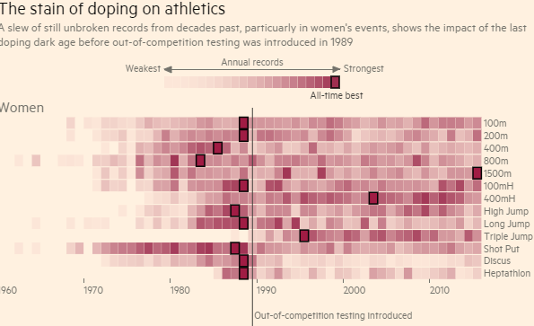

```{r setup, include = FALSE}
library(knitr)
opts_chunk$set(
  message = FALSE,
  warning = FALSE,
  cache = FALSE,
  echo=FALSE,
  fig.height = 2,
  fig.width = 5,
  collapse = TRUE,
  comment = "#>"
)
options(digits=2)
library(dplyr)
library(tidyr)
library(ggplot2)
library(readr)
library(gridExtra)
```

# Overview of this class

- Fitting a distribution for olympic medal tallies

---
# Olympic medals, 2012 London

```{r fig.align='center', fig.width=8, fig.height=4}
library(readr)
library(ggplot2)
olympics2012 <- read_csv("../data/olympics2012.csv")
df <- data.frame(Total=c(rep(0, 119), sort(olympics2012$Total)))
ggplot(df, aes(x=Total)) + geom_histogram(aes(y=..density..)) 
```

---
# Data

- Extracted from [https://www.olympic.org/london-2012](https://www.olympic.org/london-2012)
- Now it is easier to pull data from [wikipedia](https://en.wikipedia.org/wiki/2012_Summer_Olympics_medal_table)
- 204 countries participated, only countries that scored a medal (85) are listed in the medal table

---
# Medal tally

- Examine the distribution of medal counts
- Need to add 119 zeros, to account for participating countries that did not get a medal
- Distribution is right-skewed, heavily, and unimodal
- Use maximum likelihood to estimate parameters for plausible distributions

---
# Fit distribution using Poisson

```{r fig.align='center', fig.width=8, fig.height=4}
library(MASS)
library(gridExtra)
fitdistr(df$Total, "Poisson")
lam <- fitdistr(df$Total, "Poisson")$estimate
n <- 204
df1 <- data.frame(Total=df$Total+1,  
                 q=qpois(c(1 - 0.5^(1/n), (2:(n-1) - 0.3175) / 
                                (n + 0.365),0.5^(1/n)), lam))
df2 <- data.frame(x=seq(1,104,1),
                 d=dpois(seq(1,104,1), lam))
p1 <- ggplot(df1, aes(x=Total)) + geom_histogram(aes(y=..density..)) +
  geom_line(data=df2, aes(x=x, y=d), colour="red")
p2 <- ggplot(df1, aes(x=Total, y=q)) + 
  geom_abline(intercept=0, slope=1) + 
  geom_point() + xlim(c(0,105)) + ylim(c(0,105)) +
  xlab("Sample") + ylab("Theoretical quantiles") +
  theme(aspect.ratio=1)
grid.arrange(p1, p2, ncol=2)
```

---
# Try lognormal

```{r fig.align='center', fig.width=8, fig.height=4}
fitdistr(df$Total+1, "lognormal")
lam <- fitdistr(df$Total+1, "lognormal")
n <- 204
df1 <- data.frame(Total=df$Total+1,  
                 q=qlnorm(c(1 - 0.5^(1/n), (2:(n-1) - 0.3175) / 
                                (n + 0.365),0.5^(1/n)), 
                          lam$estimate))
df2 <- data.frame(x=seq(1,104,1),
                 d=dlnorm(seq(1,104,1), lam$estimate))
p1 <- ggplot(df1, aes(x=Total)) + geom_histogram(aes(y=..density..)) +
  geom_line(data=df2, aes(x=x, y=d), colour="red")
p2 <- ggplot(df1, aes(x=Total, y=q)) + 
  geom_abline(intercept=0, slope=1) + 
  geom_point() + xlim(c(0,105)) + ylim(c(0,105)) +
  xlab("Sample") + ylab("Theoretical quantiles") +
  theme(aspect.ratio=1)
grid.arrange(p1, p2, ncol=2)
```
 
---
# Try weibull

```{r fig.align='center', fig.width=8, fig.height=4}
fitdistr(df$Total+1, "weibull")
lam <- fitdistr(df$Total+1, "weibull")
n <- 204
df1 <- data.frame(Total=df$Total+1,  
                 q=qweibull(c(1 - 0.5^(1/n), (2:(n-1) - 0.3175) / 
                                (n + 0.365),0.5^(1/n)), 
                            lam$estimate[1], lam$estimate[2]))
df2 <- data.frame(x=seq(1,104,1),
                 d=dweibull(seq(1,104,1), 
                            lam$estimate[1], lam$estimate[2]))
p1 <- ggplot(df1, aes(x=Total)) + geom_histogram(aes(y=..density..)) +
  geom_line(data=df2, aes(x=x, y=d), colour="red")
p2 <- ggplot(df1, aes(x=Total, y=q)) + 
  geom_abline(intercept=0, slope=1) + 
  geom_point() + xlim(c(0,105)) + ylim(c(0,105)) +
  xlab("Sample") + ylab("Theoretical quantiles") +
  theme(aspect.ratio=1)
grid.arrange(p1, p2, ncol=2)
```
 
---
# Try pareto

```{r fig.align='center', fig.width=8, fig.height=4}
dpareto <- function(x, c) {
  # x must be greater than 1
  if (c<=0) stop("c must be positive") # Diagnostic step
  c/x^(c+1)
}
qpareto <- function(p,c){
  if (c<=0) stop("c must be positive > 0")
  if (any(p<0)|any(p>1)) # Symbol | denotes logical OR
    stop("p must be between 0 and 1")
  q <- (1-p)^(-1/c)
  q
}
fitdistr(df$Total+1, dpareto, list(c=1))
lam <- fitdistr(df$Total+1, dpareto, list(c=1))
nmle <- function(x, cr) {
  f <- prod(dpareto(x, cr))
  return(f)
}
g <- data.frame(cr = seq(0.8, 1.7, 0.01))
g$f <- 0
for (i in 1:nrow(g)) {
  g$f[i] <- nmle(df$Total+1, g$cr[i])
}
ggplot(g, aes(x=cr, y=f)) + geom_line() + xlab("c") + ylab("L") + theme_bw() + geom_vline(xintercept=1.28, color="red") +
  theme(aspect.ratio=1)
```

---
# Optimization actually fails

```{r fig.align='center', fig.width=8, fig.height=4}
n <- 204
df1 <- data.frame(Total=df$Total+1,  
                 q=qpareto(c(1 - 0.5^(1/n), (2:(n-1) - 0.3175) / 
                                (n + 0.365),0.5^(1/n)), 
                            lam$estimate))
df2 <- data.frame(x=seq(1,104,1),
                 d=dpareto(seq(1,104,1), 
                            lam$estimate))
p1 <- ggplot(df1, aes(x=Total)) + geom_histogram(aes(y=..density..)) +
  geom_line(data=df2, aes(x=x, y=d), colour="red") +
  ylim(c(0,0.25))
p2 <- ggplot(df1, aes(x=Total, y=q)) + 
  geom_abline(intercept=0, slope=1) + 
  geom_point() + xlim(c(0,105)) + ylim(c(0,105)) +
  xlab("Sample") + ylab("Theoretical quantiles") +
  theme(aspect.ratio=1)
grid.arrange(p1, p2, ncol=2)
```

---
# Manually

Actually using $c=0.96$.

```{r fig.align='center', fig.width=8, fig.height=4}
n <- 204
df1 <- data.frame(Total=df$Total+1,  
                 q=qpareto(c(1 - 0.5^(1/n), (2:(n-1) - 0.3175) / 
                                (n + 0.365),0.5^(1/n)), 
                            0.96))
df2 <- data.frame(x=seq(1,104,1),
                 d=dpareto(seq(1,104,1), 
                            0.96))
p1 <- ggplot(df1, aes(x=Total)) + geom_histogram(aes(y=..density..)) +
  geom_line(data=df2, aes(x=x, y=d), colour="red") +
  ylim(c(0,0.25))
p2 <- ggplot(df1, aes(x=Total, y=q)) + 
  geom_abline(intercept=0, slope=1) + 
  geom_point() + xlim(c(0,105)) + ylim(c(0,105)) +
  xlab("Sample") + ylab("Theoretical quantiles") +
  theme(aspect.ratio=1)
grid.arrange(p1, p2, ncol=2)
```

---
# Predict largest medal count

Using this model, what is the probability of observing a tally of more than 50 medals for a country? $P(X>50)$

```{r echo=TRUE}
ppareto <- function(q, c) {
  if (c<=0) stop("c must be positive > 0")
  ifelse(q<1, 0, 1-1/q^c)
}
1-ppareto(50, 0.96)
```

---
# How many would we expect?

If there are 204 countries, how many of them would we expect to earn more than 50 medals, assuming the $Pareto(0.96)$ model?

```{r echo=TRUE}
204*(1-ppareto(50, 0.96))
```

and how does this compare to the observed number?

```{r echo=TRUE}
library(dplyr)
df %>% filter(Total>50)
```

---
# How well does this fit 2008 medal tally?

```{r fig.align='center', fig.width=8, fig.height=4}
olympics2008 <- read_csv("../data/olympics2008.csv")
df <- data.frame(Total=c(rep(0, 117), sort(olympics2008$Total)))
n <- 204
df1 <- data.frame(Total=df$Total+1,  
                 q=qpareto(c(1 - 0.5^(1/n), (2:(n-1) - 0.3175) / 
                                (n + 0.365),0.5^(1/n)), 
                            0.96))
df2 <- data.frame(x=seq(1,104,1),
                 d=dpareto(seq(1,104,1), 
                            0.96))
p1 <- ggplot(df1, aes(x=Total)) + geom_histogram(aes(y=..density..)) +
  geom_line(data=df2, aes(x=x, y=d), colour="red") +
  ylim(c(0,0.25))
p2 <- ggplot(df1, aes(x=Total, y=q)) + 
  geom_abline(intercept=0, slope=1) + 
  geom_point() + xlim(c(0,105)) + ylim(c(0,105)) +
  xlab("Sample") + ylab("Theoretical quantiles") +
  theme(aspect.ratio=1)
grid.arrange(p1, p2, ncol=2)
```

---
# And 2004?

```{r fig.align='center', fig.width=8, fig.height=4}
olympics2004 <- read_csv("../data/olympics2004.csv")
df <- data.frame(Total=c(rep(0, 126), sort(olympics2004$Total)))
n <- 201
df1 <- data.frame(Total=df$Total+1,  
                 q=qpareto(c(1 - 0.5^(1/n), (2:(n-1) - 0.3175) / 
                                (n + 0.365),0.5^(1/n)), 
                            0.96))
df2 <- data.frame(x=seq(1,104,1),
                 d=dpareto(seq(1,104,1), 
                            0.96))
p1 <- ggplot(df1, aes(x=Total)) + geom_histogram(aes(y=..density..)) +
  geom_line(data=df2, aes(x=x, y=d), colour="red") +
  ylim(c(0,0.25))
p2 <- ggplot(df1, aes(x=Total, y=q)) + 
  geom_abline(intercept=0, slope=1) + 
  geom_point() + xlim(c(0,105)) + ylim(c(0,105)) +
  xlab("Sample") + ylab("Theoretical quantiles") +
  theme(aspect.ratio=1)
grid.arrange(p1, p2, ncol=2)
```

---
# Doping in sports - finding anomalies



Source: FT research, image extracted from [http://blogs.ft.com/ftdata/2015/11/16/doping-in-athletics/](http://blogs.ft.com/ftdata/2015/11/16/doping-in-athletics/)

---
# YOUR TURN: How could we improve the model?

---
# 

- What dependencies are there in the medal tallies?
- What varies among Olympic years?
- What factors might affect the medal counts?

---
# Resources

- [2012 Medal tally](https://en.wikipedia.org/wiki/2012_Summer_Olympics_medal_table)
- [2008 Medal tally](https://en.wikipedia.org/wiki/2008_Summer_Olympics_medal_table)
- [2004 Medal tally](https://en.wikipedia.org/wiki/2004_Summer_Olympics_medal_table)
- [http://blogs.ft.com/ftdata/2015/11/16/doping-in-athletics/](http://blogs.ft.com/ftdata/2015/11/16/doping-in-athletics/)

---
class: inverse middle 
# Share and share alike

<a rel="license" href="http://creativecommons.org/licenses/by/4.0/"></a><br />This work is licensed under a <a rel="license" href="http://creativecommons.org/licenses/by/4.0/">Creative Commons Attribution 4.0 International License</a>.
