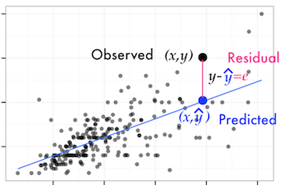
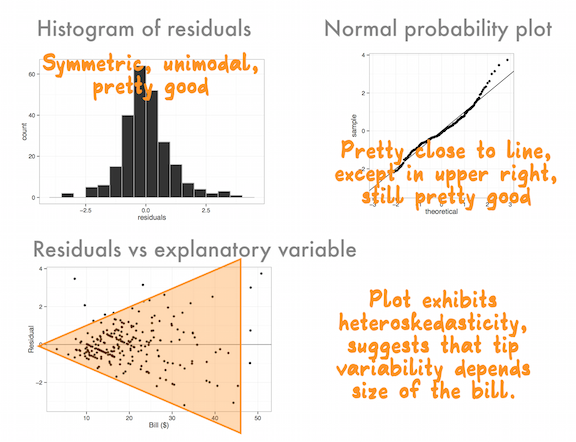
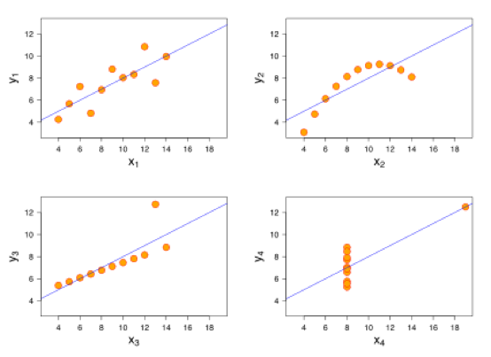

```{r setup, include = FALSE}
library(knitr)
opts_chunk$set(
  message = FALSE,
  warning = FALSE,
  cache = FALSE,
  echo=FALSE,
  fig.height = 2,
  fig.width = 5,
  collapse = TRUE,
  comment = "#>"
)
options(digits=2)
library(dplyr)
library(tidyr)
library(ggplot2)
library(readr)
library(gridExtra)
```

# Overview of this class

- Fitting a linear model to olympic medal tally
- Review of linear regression

---
# Modeling Olympic medal counts

How does medal count in 2016 associate with that from the previous Olympics and the country's population and GDP?

```{r fig.width=10, fig.height=4}
olympics2012 <- read_csv("../data/olympics2012.csv")
oly_gdp2016 <- read_csv("../data/gdp2016.csv")

oly_gdp_2016_2012 <- merge(oly_gdp2016, olympics2012[,c("Country","Total")],
                     by="Country", all.x=TRUE)
colnames(oly_gdp_2016_2012)[2] <- "Total_2016"
colnames(oly_gdp_2016_2012)[7] <- "Total_2012"

oly_gdp_2016_2012[is.na(oly_gdp_2016_2012$Total_2012), "Total_2012"] <- 0
p1 <- ggplot(oly_gdp_2016_2012, aes(x=Total_2012, y=Total_2016)) +
  geom_point()
p2 <- ggplot(oly_gdp_2016_2012, aes(x=Population_mil, y=Total_2016)) +
  geom_point()
p3 <- ggplot(oly_gdp_2016_2012, aes(x=GDP_PPP_bil, y=Total_2016)) +
  geom_point()
grid.arrange(p1, p2, p3, ncol=3)
```

---
# Model fit summary
 
$$M_{2016} = \beta_0 + \beta_1 M_{2012} + \beta_2 Population + \beta_3 GDP + \varepsilon$$
 
```{r}
oly_lm <- glm(Total_2016~Total_2012+Population_mil+GDP_PPP_bil, data=oly_gdp_2016_2012)
library(broom)
tidy(oly_lm)
```

```{r}
glance(oly_lm)
```

---
# Fit and residuals

```{r fig.align='center', fig.width=8, fig.height=4}
oly_diag <- augment(oly_lm)
oly_diag$Country <- oly_gdp2016$Country
p1 <- ggplot(oly_diag, aes(x=.fitted, y=Total_2016, 
                                   label=Country)) +
  geom_point() + ylab("Observed Count") + xlab("Fitted") +
  theme(aspect.ratio=1)
p2 <- ggplot(oly_diag, aes(x=.fitted, y=.resid, label=Country)) + geom_point() + ylab("Residuals") + xlab("Fitted") +
  theme(aspect.ratio=1)
grid.arrange(p1, p2, ncol=2)
```

---
# Make plots interactive

```{r fig.height=5, fig.width=5, fig.show='asis'}
library(plotly)
ggplotly(p2)
```

---
# Make plots interactive

```{r fig.height=5, fig.width=5, fig.show='asis'}
ggplotly(p1)
```

---
# Simple linear model

The model,

$$Y = \beta_0 + \beta_1 X + \varepsilon$$

- Explains how response variable, $Y$, changes in relation to explanatory variable, $X$, on average.
- Use line to predict value of $Y$ for a given value of $X$

```{r fig.align='center', fig.width=5, fig.height=3}
library(xkcd)
x <- runif(100) - 0.5
df <- data.frame(x=x, y=-3*x+5+rnorm(100))
ggplot(df, aes(x=x, y=y)) + geom_point() + 
  geom_smooth(method="lm", se=F) + xlab("X") + ylab("Y") +
  geom_text(aes(x=0.35, y=7,
                label="linear model"), colour="blue", size=4) +
  theme_bw() +
  theme_xkcd()
# install.packages("wesanderson")
# devtools::install_github("dill/beyonce")
```

---
# Observed, fitted, residuals

- Observed value is $Y$ (a point on plot)
- Fitted value is $\hat{Y}$, a value that lies on the line
- Residual is the difference between observed and fitted, $e=Y-\hat{Y}$



---
# Fitting process

- Minimizing the sum of squared residuals produces the best fitting line.
- Minimizes $\sum e^2$
- Line that is closest to the points, as a whole.

---
# Parameter interpretation

- Line of best fit: $\hat{Y}=b_0+b_1X$
- $b_0$ is the intercept of the line with y-axis
- $b_1$ is the slope of the line

---
# Calculating manually

Given standard deviation of $X$, $s_x$, standard deviation of $Y$, $s_y$, and the correlation, $r$,  between the two, the slope is computed by

$$b_1 = r\frac{s_y}{s_x}$$

and given the sample means $\bar{X}, \bar{Y}$

$$b_0 = \bar{Y} - b_1\bar{X}$$

---
class: inverse middle 
# YOUR TURN

(Complete questions online)

- Is the point $\bar{X}, \bar{Y}$ on the regression line?

---
# Prediction

For given $X$ values, plug these into the model equation to predict $Y$, 

$$\hat{Y} = b_0 + b_1 X$$

---
# Goodness of fit

- $R^2$ is the proportion of variation in $Y$ that is explained by $X$. Computed by  $$ R^2 = 1- \frac{\sum e^2}{\sum Y^2} $$
- __Deviance__: up to a constant, minus twice the maximized log-likelihood. It is the modern analog to residual sum of squares, that measures the relative merits of two models. 

---
# Reading residual plots

- Make a histogram and normal probability plot of the residuals - for a good fit the shape should be pretty symmetric and bell-shaped
- Plot the residuals against the fitted values - for a good fit should be just a random splatter, no patterns

---
# Residual plots



---
# More diagnostics

- __Influential points__: leverage (diagonal elements of hat matrix, values $> 2p/n$ would indicate cases with high influence), cooksd (Cooks distance, measures the change in the residual when the case is removed)
- __Collinearity__ between explanatory variables (multiple regression): variance inflation factor

```{r fig.width=8, fig.height=3}
p1 <- ggplot(oly_gdp_2016_2012, aes(x=Total_2012, y=Population_mil)) +
  geom_point()
p2 <- ggplot(oly_gdp_2016_2012, aes(x=Population_mil, y=GDP_PPP_bil)) +
  geom_point()
grid.arrange(p1, p2, ncol=2)
```

---
# Cautions

- Association is not causation
- Linear association only
- Extrapolation outside the range of the data is not recommended

---
# Anscombe's quartet



Always plot the data, because very different patterns can lead to the same correlation. 

---
# Resources

- [Statistics online textbook, Diez, Barr, Cetinkaya-Rundel](https://www.openintro.org/stat/textbook.php?stat_book=isrs)
- [Ancombe's quartet](http://en.wikipedia.org/wiki/Anscombe's_quartet)

---
class: inverse middle 
# Share and share alike

<a rel="license" href="http://creativecommons.org/licenses/by/4.0/"></a><br />This work is licensed under a <a rel="license" href="http://creativecommons.org/licenses/by/4.0/">Creative Commons Attribution 4.0 International License</a>.
