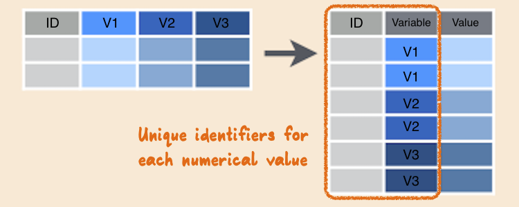
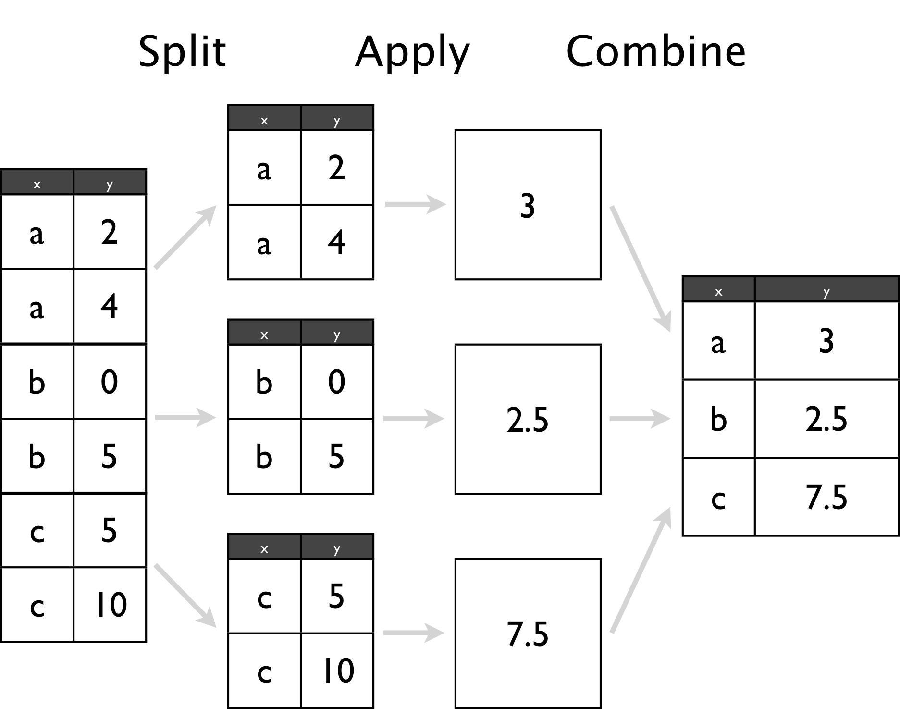

```{r setup, include = FALSE}
library(knitr)
opts_chunk$set(
  message = FALSE,
  warning = FALSE,
  cache = FALSE,
  echo=FALSE,
  fig.align='center', 
  fig.height = 4,
  fig.width = 4,
  collapse = TRUE,
  comment = "#>"
)
library(dplyr)
library(tidyr)
library(ggplot2)
library(readr)
library(gridExtra)
```

## Overview of this class

- What is `tidy data`? Why do you want tidy data? Getting your data into tidy form using tidyr.
- Wrangling verbs: `filter`, `arrange`, `select`, `mutate`, `summarise`, with dplyr
- Date and time with lubridate

## Terminology

1. `Cases, records, individuals, subjects, experimental units, example, instance`: things we are collecting information about
2. `Variables, attributes, fields, features`: what we are measuring on each record/case/.../instance

Generally we think of cases being on the rows, and variables being in the columns of a table. This is a basic data structure. BUT data often is given to us in many other shapes than this. Getting into a tidy shape will allow you to efficiently use it for modeling.

## Example 1

```{r echo=FALSE}
grad <- read_csv("../data/graduate-programs.csv")
kable(head(grad[1:4,c(2,3,4,6)]))
```

<br>

- Cases: __________
- Variables: __________

```{r echo=FALSE, eval=FALSE}
- Cases:  graduate programs
- Variables: subject, Inst, AvNumPubs, ...
```


## Example 2

```{r}
melbtemp <- read.fwf("../data/ASN00086282.dly", 
   c(11, 4, 2, 4, rep(c(5, 1, 1, 1), 31)), fill=T)
kable(head(melbtemp[1:4,c(1,2,3,4,seq(5,128,4))]))
```

<br>

- Cases: __________
- Variables: __________

```{r echo=FALSE, eval=FALSE}
- Each row of data provided contains the values for one month!
- Cases: days
- Variables: TMAX, TMIN, PRCP, year, month, day, stationid. 
```

## Example 3

Here are the column headers ...

```{r}
tb <- read_csv("../data/tb.csv")
#tail(tb)
colnames(tb)
```

<br>

- Cases: __________
- Variables: __________

```{r echo=FALSE, eval=FALSE}
- Each row of data provided contains the values for one month!
- Cases: days
- Variables: TMAX, TMIN, PRCP, year, month, day, stationid. 
```

## Example 4 

We'll commonly find these data on web sites:

```{r}
pew <- read.delim(
  file = "http://stat405.had.co.nz/data/pew.txt",
  header = TRUE,
  stringsAsFactors = FALSE,
  check.names = F
)
kable(pew[1:5, 1:5])
```

- Cases: __________
- Variables: __________

## Example 5

10 week sensory experiment, 12 individuals assessed taste of french fries on several scales (how potato-y, buttery, grassy, rancid, paint-y do they taste?), fried in one of 3 different oils, replicated twice. First few rows:

```{r, echo = FALSE}
data(french_fries, package = "reshape2")
kable(head(french_fries, 4), format = "markdown", row.names = F)
```

What do you like to know?

## {.flexbox .vcenter #myImagePage1}


## Messy Data Patterns

There are various features of messy data that one can observe in practice. Here are some of the more commonly observed patterns.

- Column headers are values, not variable names
- Variables are stored in both rows and columns, contingency table format
- Information stored in multiple tables
- Dates in many different formats
- 
- Not easy to analyse

## What is Tidy Data?

- Each observation forms a row
- Each variable forms a column
- Contained in a single table
- Long form makes it easier to reshape in many different ways
- Wide form is common for analysis/modeling

## {.flexbox .vcenter #myImagePage1}


## {.flexbox .vcenter #myImagePage1}


## Tidy vs Messy

- Tidy data facilitates analysis in many different ways, answering multiple questions, applying methods to new data or other problems
- Messy data may work for one particular problem but is not generalisable

## Tidy Verbs

- `gather`: specify the `keys` (identifiers) and the `values` (measures) to make long form (used to be called melting)
- `spread`: variables in columns (used to be called casting)
- nest/unnest: working with lists
- separate/unite: split and combine columns

## French fries example

```{r, echo = FALSE}
library(reshape2)
library(tidyr)

kable(head(french_fries))
```

## This format is not ideal for data analysis

What code would be needed to plot each of the ratings over time as a different color?

```
library(ggplot2)
french_sub <- french_fries[french_fries$time == 10,]
ggplot(data = french_sub) + 
  geom_boxplot(aes(x="1_potato", y=potato), fill = I("red")) +
 geom_boxplot(aes(x = "2_buttery", y = buttery), fill = I("orange")) +
 geom_boxplot(aes(x = "3_grassy", y = grassy), fill = I("yellow")) +
 geom_boxplot(aes(x = "4_rancid", y = rancid), fill = I("green")) +
 geom_boxplot(aes(x = "5_painty", y = painty), fill = I("blue")) +
    xlab("variable") + ylab("rating")
```

## The plot

```{r, echo=FALSE, fig.width=6}
library(ggplot2)

french_sub <- french_fries[french_fries$time == 10,]

ggplot(data = french_sub) + 
  geom_boxplot(aes(x="1_potato", y=potato), fill = I("red")) +
 geom_boxplot(aes(x = "2_buttery", y = buttery), fill = I("orange")) +
 geom_boxplot(aes(x = "3_grassy", y = grassy), fill = I("yellow")) +
 geom_boxplot(aes(x = "4_rancid", y = rancid), fill = I("green")) +
 geom_boxplot(aes(x = "5_painty", y = painty), fill = I("blue")) +
    xlab("variable") + ylab("rating")
```

## Wide to long {.flexbox .vcenter #myImagePage1}



## Gathering

+ When gathering, you need to specify the **keys** (identifiers) and the **values** (measures).

+ Keys/Identifiers:
    - Identify a record (must be unique)
    - Example: Indices on an random variable
    - Fixed by design of experiment (known in advance)
    - May be single or composite (may have one or more variables)

+ Values/Measures:
    - Collected during the experiment (not known in advance)
    - Usually numeric quantities

## Gathering the French Fries Data

```
ff_long <- gather(french_fries, key = variable, 
  value = rating, potato:painty)

head(ff_long)
```

```{r, echo=F}
ff_long <- gather(french_fries, key = variable, 
                            value = rating, potato:painty)

head(ff_long)
```

## Let's re-write the code for our Plot

```
ff_long_sub <- ff_long[
  french_fries_long$time == 10,]

ggplot(data = ff_long_sub, 
  aes(x=variable, y=rating,  fill = variable)) +
   geom_boxplot()
```

## And plot it

```{r, echo=FALSE, fig.width=6}
ff_long_sub <- ff_long[
  ff_long$time == 10,]

ggplot(data = ff_long_sub, 
       aes(x=variable, y=rating,  fill = variable)) +
   geom_boxplot()
```

## Long to Wide

In certain applications, we may wish to take a long dataset and convert it to a wide dataset (Perhaps displaying in a table).

```{r echo=FALSE}
head(ff_long)
```

## Spread

We use the **spread** function from tidyr to do this:

```
ff_wide <- spread(ff_long, 
  key = variable, value = rating)
head(ff_wide)
```

```{r echo=FALSE}
ff_wide <- spread(ff_long, 
        key = variable, value = rating)

head(ff_wide)
```

## The Split-Apply-Combine Approach

- *Split* a dataset into many smaller sub-datasets
- *Apply* some function to each sub-dataset to compute a result
- *Combine* the results of the function calls into a one dataset

## The Split-Apply-Combine Approach {.flexbox .vcenter #myImagePage1}



## Split-Apply-Combine in dplyr

```
library(dplyr)
ff_summary <- group_by(ff_long, variable) %>% # SPLIT
  summarise(
      m = mean(rating, na.rm = TRUE), 
      s=sd(rating, na.rm=TRUE)) # APPLY + COMBINE
ff_summary
```

```{r echo=FALSE, message=FALSE, error=FALSE}
library(dplyr)
ff_summary <- group_by(ff_long, variable) %>% # SPLIT
  summarise(
      m = mean(rating, na.rm = TRUE), 
      s=sd(rating, na.rm=TRUE)) # APPLY + COMBINE
ff_summary
```

## Pipes

- Pipes historically enable data analysis pipelines
- Pipes allow the code to be <strong>read</strong> like a sequence of operations
- dplyr allows us to chain together these data analysis tasks using the `%>%` (pipe) operator
- `x %>% f(y)` is shorthand for `f(x, y)`
- Example:

```{r echo=TRUE}
student2012.sub <- readRDS("../data/student_sub.rds")
student2012.sub %>% 
  group_by(CNT) %>% 
  tally()
```

## dplyr verbs

There are five primary dplyr `verbs`, representing distinct data analysis tasks:

- `Filter`: Remove the rows of a data frame, producing subsets
- `Arrange`: Reorder the rows of a data frame
- `Select`: Select particular columns of a data frame
- `Mutate`: Add new columns that are functions of existing columns
- `Summarise`: Create collapsed summaries of a data frame
 
## Filter

```
french_fries %>%
    filter(subject == 3, time == 1)
```

```{r echo=FALSE}
french_fries %>%
    filter(subject == 3, time == 1)
```

## Arrange

```
french_fries %>%
    arrange(desc(rancid)) %>%
    head
```

```{r echo=FALSE}
french_fries %>%
    arrange(desc(rancid)) %>%
    head
```

## Select

```
french_fries %>%
    select(time, treatment, subject, rep, potato) %>%
    head
```

```{r echo=FALSE}
french_fries %>%
    select(time, treatment, subject, rep, potato) %>%
    head
```

## Mutate

```
french_fries %>%
    mutate(yucky = grassy+rancid+painty) %>%
  head
```

```{r echo=FALSE}
french_fries %>%
    mutate(yucky = grassy+rancid+painty) %>%
  head
```


## Summarise

```
french_fries %>%
    group_by(time, treatment) %>%
    summarise(mean_rancid = mean(rancid), 
    sd_rancid = sd(rancid))
```

```{r echo=FALSE}
french_fries %>%
    group_by(time, treatment) %>%
    summarise(mean_rancid = mean(rancid), 
              sd_rancid = sd(rancid))
```

## Dates and Times

- Dates are deceptively hard to work with 
- 02/05/2012. Is it February 5th, or May 2nd?
- Time zones
- Different starting times of stock markets, airplane departure and arrival

## Basic Lubridate Use

```{r echo=TRUE}
library(lubridate)

now()
now(tz = "America/Chicago")
today()
now() + hours(4)
today() - days(2)
ymd("2013-05-14")
mdy("05/14/2013")
dmy("14052013")
```

## Dates example: Oscars date of birth

```{r echo=TRUE}
oscars <- read_csv("../data/oscars.csv")
oscars <- oscars %>% mutate(DOB = mdy(DOB))
head(oscars$DOB)
summary(oscars$DOB)
```

## Calculating on dates

- You should never ask a woman her age, but ... really!

```{r echo=TRUE}
oscars <- oscars %>% mutate(year=year(DOB))
summary(oscars$year)
oscars %>% filter(year == "2029") %>% 
  select(Name, Sex, DOB)
```

## Months

```{r, echo=TRUE}
oscars <- oscars %>% mutate(month=month(DOB, label = TRUE, abbr = TRUE))
table(oscars$month)
```

## Now plot it

```{r echo=TRUE, fig.width=8, fig.height=4}
ggplot(data=oscars, aes(month)) + geom_bar()
```

## Should you be born in April?

```{r echo=TRUE, fig.width=8, fig.height=4}
df <- data.frame(m=sample(1:12, 423, replace=TRUE))
df$m2 <- factor(df$m, levels=1:12, 
  labels=month.abb)
ggplot(data=df, aes(x=m2)) + geom_bar()
```


## Resources

- [Tidy data](http://vita.had.co.nz/papers/tidy-data.pdf)
- [Split-apply-combine](http://vita.had.co.nz/papers/plyr.pdf)
- [RStudio cheat sheets](https://www.rstudio.com/resources/cheatsheets/)
- [Working with dates and times](https://www.jstatsoft.org/article/view/v040i03/v40i03.pdf)
- [R for Data Science](http://r4ds.had.co.nz)

## Share and share alike

This work is licensed under the Creative Commons Attribution-Noncommercial 3.0 United States License. To view a copy of this license, visit http://creativecommons.org/licenses/by-nc/ 3.0/us/ or send a letter to Creative Commons, 171 Second Street, Suite 300, San Francisco, California, 94105, USA.
