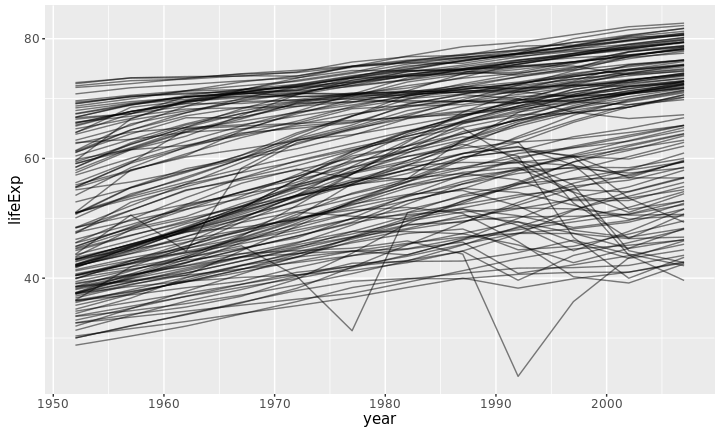
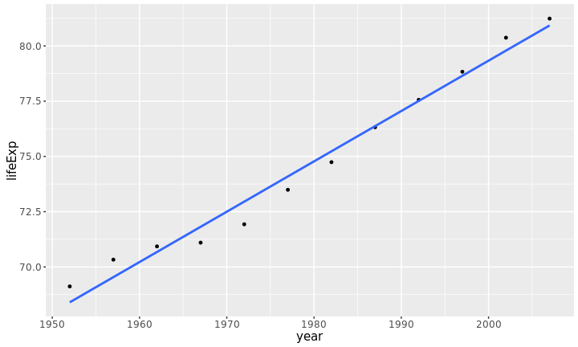
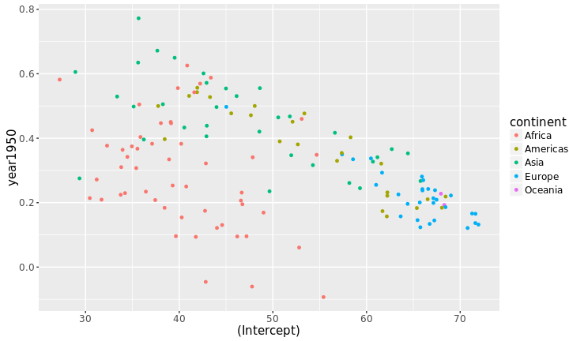

# Exploratory data analysis (EDA) with R

> The greatest value of a picture is when it forces us to notice what we never expected to see. -- J. W. Tukey (1977)

* Load the necessary packages in the beginning


```r
library(tidyr)
library(dplyr)
library(knitr)
library(broom)
library(purrr)
library(plotly)
library(ggplot2)
```

* Take a glimpse at the dataset `gapminder`


```r
library(gapminder)
glimpse(gapminder)
```

```
## Observations: 1,704
## Variables: 6
## $ country   <fctr> Afghanistan, Afghanistan, Afghanistan, Afghanistan,...
## $ continent <fctr> Asia, Asia, Asia, Asia, Asia, Asia, Asia, Asia, Asi...
## $ year      <int> 1952, 1957, 1962, 1967, 1972, 1977, 1982, 1987, 1992...
## $ lifeExp   <dbl> 28.801, 30.332, 31.997, 34.020, 36.088, 38.438, 39.8...
## $ pop       <int> 8425333, 9240934, 10267083, 11537966, 13079460, 1488...
## $ gdpPercap <dbl> 779.4453, 820.8530, 853.1007, 836.1971, 739.9811, 78...
```

## Data visualisation

* It's difficult for us to process numerical information in raw form.
* That's why statistical graphics come to play.


```r
ggplot(data = gapminder, aes(x = year, y = lifeExp, group = country)) +
  geom_line(alpha = 0.5)
```



## Data modelling

<ul> 
<li>Transform</li>


```r
gapminder2 <- gapminder %>% mutate(year1950 = year - 1950)
```

<li>Start with Australia</li>


```r
oz <- gapminder2 %>% filter(country == "Australia")
head(oz)
```

```
## # A tibble: 6 x 7
##     country continent  year lifeExp      pop gdpPercap year1950
##      <fctr>    <fctr> <int>   <dbl>    <int>     <dbl>    <dbl>
## 1 Australia   Oceania  1952   69.12  8691212  10039.60        2
## 2 Australia   Oceania  1957   70.33  9712569  10949.65        7
## 3 Australia   Oceania  1962   70.93 10794968  12217.23       12
## 4 Australia   Oceania  1967   71.10 11872264  14526.12       17
## 5 Australia   Oceania  1972   71.93 13177000  16788.63       22
## 6 Australia   Oceania  1977   73.49 14074100  18334.20       27
```

<li>Fit a simple regression for Australia

$$\widehat{\mathrm{lifeExp}}_{i} = \hat{\beta}_0 + \hat{\beta}_1 \times \mathrm{year1950}_{i}$$

<ol>
<li>Graphically</li>


```r
ggplot(data = oz, aes(x = year, y = lifeExp)) + 
  geom_point() + 
  geom_smooth(method = "lm", se = FALSE)
```



<li>Statistically</li>


```r
oz_lm <- lm(lifeExp ~ year1950, data = oz) # Y = a + b*X
oz_lm # equivalent to print(oz_lm): prints only formula and coeffcients
```

```
## 
## Call:
## lm(formula = lifeExp ~ year1950, data = oz)
## 
## Coefficients:
## (Intercept)     year1950  
##     67.9451       0.2277
```

```r
summary(oz_lm) # returns detailed summary
```

```
## 
## Call:
## lm(formula = lifeExp ~ year1950, data = oz)
## 
## Residuals:
##     Min      1Q  Median      3Q     Max 
## -1.0250 -0.5201  0.1162  0.3781  0.7909 
## 
## Coefficients:
##             Estimate Std. Error t value Pr(>|t|)    
## (Intercept) 67.94507    0.35476  191.53  < 2e-16 ***
## year1950     0.22772    0.01038   21.94 8.67e-10 ***
## ---
## Signif. codes:  0 '***' 0.001 '**' 0.01 '*' 0.05 '.' 0.1 ' ' 1
## 
## Residual standard error: 0.6206 on 10 degrees of freedom
## Multiple R-squared:  0.9796,	Adjusted R-squared:  0.9776 
## F-statistic: 481.3 on 1 and 10 DF,  p-value: 8.667e-10
```

```r
class(oz_lm) # 'lm' object
```

```
## [1] "lm"
```

<li>Prediction</li>


```r
new_df <- data.frame(year1950 = c(0, 50, 66)) # 1950, 2000, 2016
predict(oz_lm, newdata = new_df)
```

```
##        1        2        3 
## 67.94507 79.33125 82.97483
```

```r
# Manually calculate the predicted life expectancy in 1950, 2000, 2016
au_coef <- coefficients(oz_lm)
au_coef[1] + au_coef[2] * c(0, 50, 66)
```

```
## [1] 67.94507 79.33125 82.97483
```

<li>Diagnostics


```r
oz_coef <- tidy(oz_lm) # the tidy form of the lm object
oz_coef
```

```
##          term   estimate  std.error statistic      p.value
## 1 (Intercept) 67.9450653 0.35475797  191.5251 3.700841e-19
## 2    year1950  0.2277238 0.01037958   21.9396 8.667222e-10
```

```r
oz_fit <- glance(oz_lm) # the diagnostics from lm object
oz_fit
```

```
##   r.squared adj.r.squared     sigma statistic      p.value df    logLik
## 1 0.9796477     0.9776125 0.6206086  481.3459 8.667222e-10  2 -10.20868
##        AIC      BIC deviance df.residual
## 1 26.41735 27.87207  3.85155          10
```

```r
oz_diag <- augment(oz_lm) # additional information like residuals
oz_diag
```

```
##    lifeExp year1950  .fitted   .se.fit      .resid       .hat    .sigma
## 1   69.120        2 68.40051 0.3370035  0.71948718 0.29487179 0.5885398
## 2   70.330        7 69.53913 0.2943424  0.79086830 0.22494172 0.5816212
## 3   70.930       12 70.67775 0.2551280  0.25224942 0.16899767 0.6476436
## 4   71.100       17 71.81637 0.2212012 -0.71636946 0.12703963 0.6021888
## 5   71.930       22 72.95499 0.1953366 -1.02498834 0.09906760 0.5462421
## 6   73.490       27 74.09361 0.1810238 -0.60360723 0.08508159 0.6194376
## 7   74.740       32 75.23223 0.1810238 -0.49222611 0.08508159 0.6312890
## 8   76.320       37 76.37084 0.1953366 -0.05084499 0.09906760 0.6539352
## 9   77.560       42 77.50946 0.2212012  0.05053613 0.12703963 0.6539304
## 10  78.830       47 78.64808 0.2551280  0.18191725 0.16899767 0.6507881
## 11  80.370       52 79.78670 0.2943424  0.58329837 0.22494172 0.6157712
## 12  81.235       57 80.92532 0.3370035  0.30967949 0.29487179 0.6425249
##         .cooksd  .std.resid
## 1  0.3985452403  1.38061071
## 2  0.3040493566  1.44750213
## 3  0.0202148732  0.44587310
## 4  0.1110602709 -1.23544103
## 5  0.1664636939 -1.74002323
## 6  0.0480744299 -1.01682325
## 7  0.0319694063 -0.82919310
## 8  0.0004096170 -0.08631460
## 9  0.0005526989  0.08715392
## 10 0.0105137692  0.32155479
## 11 0.1653930580  1.06759321
## 12 0.0738339980  0.59423827
```

<ul>
<li>Hat matrix $H$</li>
</li>
</li>
</ul>
</ol>
</ul>
$$H = X(X'X)^{-1}X' $$
$$\hat{y} = Hy = X\hat{\beta}$$

# Fitting many models at a time (using `purrr`)

There exists a more **elegant** way to fit many models than a `for loop`.

## Data structures --- lists


```r
# df = a list of data.frame
list_df <- list(df = data.frame(x = 1:5, y = 1:5 + rnorm(5)))
# adding a new element called ols that is an lm object
list_df$ols <- lm(y ~ x, data = list_df$df)
list_df
```

```
## $df
##   x        y
## 1 1 1.981736
## 2 2 3.309304
## 3 3 3.590043
## 4 4 2.723392
## 5 5 5.153070
## 
## $ols
## 
## Call:
## lm(formula = y ~ x, data = list_df$df)
## 
## Coefficients:
## (Intercept)            x  
##      1.6245       0.5757
```

## Nesting the data into a list


```r
by_country <- gapminder2 %>% 
  select(country, year1950, lifeExp, continent) %>%
  group_by(country, continent) %>% 
  nest() # nesting year1950 & lifeExp into a list
head(by_country)
```

```
## # A tibble: 6 x 3
##       country continent              data
##        <fctr>    <fctr>            <list>
## 1 Afghanistan      Asia <tibble [12 x 2]>
## 2     Albania    Europe <tibble [12 x 2]>
## 3     Algeria    Africa <tibble [12 x 2]>
## 4      Angola    Africa <tibble [12 x 2]>
## 5   Argentina  Americas <tibble [12 x 2]>
## 6   Australia   Oceania <tibble [12 x 2]>
```

```r
head(by_country$data[[6]]) # data frame for Australia
```

```
## # A tibble: 6 x 2
##   year1950 lifeExp
##      <dbl>   <dbl>
## 1        2   69.12
## 2        7   70.33
## 3       12   70.93
## 4       17   71.10
## 5       22   71.93
## 6       27   73.49
```

## Mapping a list of the data to `lm`


```r
by_country <- by_country %>% 
  mutate(model = map(data, ~ lm(lifeExp ~ year1950, data = .)))
head(by_country)
```

```
## # A tibble: 6 x 4
##       country continent              data    model
##        <fctr>    <fctr>            <list>   <list>
## 1 Afghanistan      Asia <tibble [12 x 2]> <S3: lm>
## 2     Albania    Europe <tibble [12 x 2]> <S3: lm>
## 3     Algeria    Africa <tibble [12 x 2]> <S3: lm>
## 4      Angola    Africa <tibble [12 x 2]> <S3: lm>
## 5   Argentina  Americas <tibble [12 x 2]> <S3: lm>
## 6   Australia   Oceania <tibble [12 x 2]> <S3: lm>
```

```r
by_country$model[[6]] # class: lm
```

```
## 
## Call:
## lm(formula = lifeExp ~ year1950, data = .)
## 
## Coefficients:
## (Intercept)     year1950  
##     67.9451       0.2277
```

## Unnesting a list of `lm` back to data frame


```r
country_coefs <- by_country %>% 
  unnest(model %>% map(tidy)) # pull list back to normal data frame
head(country_coefs)
```

```
## # A tibble: 6 x 7
##       country continent        term   estimate  std.error statistic
##        <fctr>    <fctr>       <chr>      <dbl>      <dbl>     <dbl>
## 1 Afghanistan      Asia (Intercept) 29.3566375 0.69898128  41.99918
## 2 Afghanistan      Asia    year1950  0.2753287 0.02045093  13.46289
## 3     Albania    Europe (Intercept) 58.5597618 1.13357581  51.65933
## 4     Albania    Europe    year1950  0.3346832 0.03316639  10.09104
## 5     Algeria    Africa (Intercept) 42.2364149 0.75626904  55.84840
## 6     Algeria    Africa    year1950  0.5692797 0.02212707  25.72775
## # ... with 1 more variables: p.value <dbl>
```

## Making a tidy report


```r
country_coefs <- country_coefs %>% 
  select(country, continent, term, estimate) %>% 
  spread(term, estimate)
head(country_coefs) %>% kable() # knitr::kable helps to knit to markdown table
```


|country     |continent | (Intercept)|  year1950|
|:-----------|:---------|-----------:|---------:|
|Afghanistan |Asia      |    29.35664| 0.2753287|
|Albania     |Europe    |    58.55976| 0.3346832|
|Algeria     |Africa    |    42.23641| 0.5692797|
|Angola      |Africa    |    31.70797| 0.2093399|
|Argentina   |Americas  |    62.22502| 0.2317084|
|Australia   |Oceania   |    67.94507| 0.2277238|

## Visualising data

* Static


```r
ggplot(country_coefs, aes(x = `(Intercept)`, y = year1950, colour = continent,
                          group = country)) +
  geom_point()
```



* Interactive


```r
ggplotly()
```

<iframe src="inter.html" height = "85%" width = "90%" align = "middle"></iframe>

## Better models?


```r
country_fit <- by_country %>% 
  unnest(model %>% map(glance))
head(country_fit)
```

```
## # A tibble: 6 x 15
##       country continent              data    model r.squared adj.r.squared
##        <fctr>    <fctr>            <list>   <list>     <dbl>         <dbl>
## 1 Afghanistan      Asia <tibble [12 x 2]> <S3: lm> 0.9477123     0.9424835
## 2     Albania    Europe <tibble [12 x 2]> <S3: lm> 0.9105778     0.9016355
## 3     Algeria    Africa <tibble [12 x 2]> <S3: lm> 0.9851172     0.9836289
## 4      Angola    Africa <tibble [12 x 2]> <S3: lm> 0.8878146     0.8765961
## 5   Argentina  Americas <tibble [12 x 2]> <S3: lm> 0.9955681     0.9951249
## 6   Australia   Oceania <tibble [12 x 2]> <S3: lm> 0.9796477     0.9776125
## # ... with 9 more variables: sigma <dbl>, statistic <dbl>, p.value <dbl>,
## #   df <int>, logLik <dbl>, AIC <dbl>, BIC <dbl>, deviance <dbl>,
## #   df.residual <int>
```

# When to use `::` in R

* When two different packages have the same function name, for example, there is
  a function called `is.weekend()` from both the `chron` and `tseries` packages loaded 
  into R. `chron::is.weekend()` tells R to use `is.weekend()` from `chron` instead
  of `tseries`.


```r
library(chron)
library(tseries)
chron::is.weekend() # use is.weekend() from the package chron
# tseries::is.weekend()
```

* In the lab instruction, the `purrr::map` and `broom::tidy` are unnecessary, since
  there are no conflicting function names in the current R session. However, Di
  uses `::` to indicate that `map` is from `purrr` and `tidy` is from `broom`.


```r
country_coefs <- by_country %>% 
  unnest(model %>% purrr::map(broom::tidy))
```

# Misc

## Online R resources

* [R for data science](http://r4ds.had.co.nz/lists.html) 
* [Managing many models](http://wombat2016.org/slides/hadley.pdf) given by Hadley Wickham
  at Wombat 2016, along with the [youtube video](https://www.youtube.com/watch?v=hRNUgwAFZtQ)

## Consultation hours

* Earo
    * **Time**: 13:30 to 15:00 on Thursday
    * **Venue**: Level 11/W1106, Menzies Building
* Nathaniel
    * **Time**: 14:00 to 15:00 on Tuesday
    * **Venue**: Level 11/W1106, Menzies Building

<meta name="copyright" content="LICENSE: CC BY-NC 3.0 US" />
