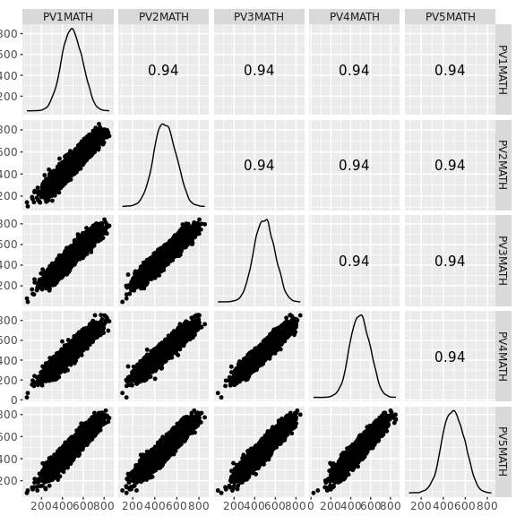
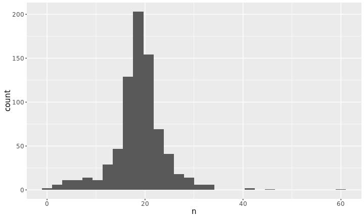
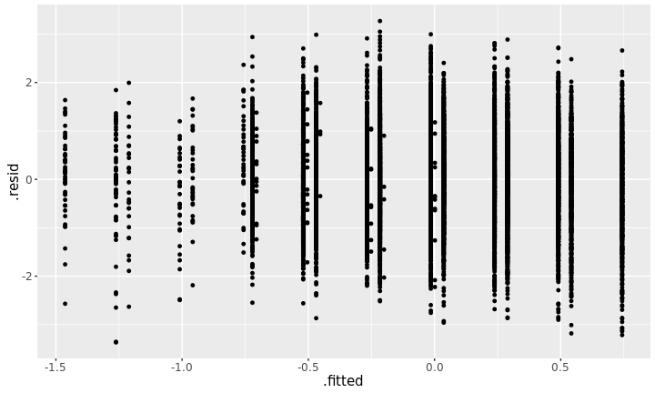
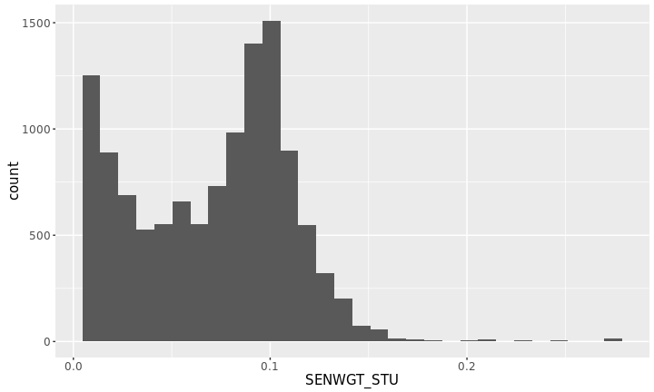
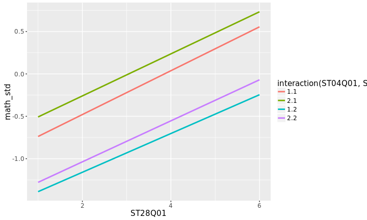

# Hands-on data analysis with R

<!-- break -->


```r
library(tidyr)
library(dplyr)
library(purrr)
library(broom)
library(ggplot2)
```

## Get real data

* Real datasets come in different data files, such as `csv`, `txt`, `json`, `xml`,
  and etc.
    + Getting the current working directory in R


```r
getwd() # getting the current working directory
```

```
## [1] "/home/earo/Teaching/Statistical_Thinking/tutorials/lab06"
```

* Read the data in


```r
student2012.sub <- readRDS("../../data/student_sub.rds") 
australia <- student2012.sub %>% 
  filter(CNT == "AUS")
summary(australia)
```


```
##      CNT               SCHOOLID        ST04Q01         ST06Q01    
##  Length:14481       Min.   :  1.0   Min.   :1.000   Min.   :   4  
##  Class :character   1st Qu.:194.0   1st Qu.:1.000   1st Qu.:   5  
##  Mode  :character   Median :392.0   Median :2.000   Median :   5  
##                     Mean   :388.9   Mean   :1.511   Mean   : 794  
##                     3rd Qu.:583.0   3rd Qu.:2.000   3rd Qu.:   6  
##                     Max.   :775.0   Max.   :2.000   Max.   :9999
```

## Poke around the data using graphics

* Look at the correlations using scatter matrix plots


```r
library(GGally)
ggscatmat(australia, columns = 35:39)
```




```r
australia <- australia %>% 
  mutate(math = (PV1MATH + PV2MATH + PV3MATH + PV4MATH + PV5MATH) / 5)
```

* Look at the distribution of Australian schools


```r
aus_schools <- australia %>% 
  group_by(SCHOOLID) %>% 
  tally() %>% 
  arrange(desc(n)) 
dim(aus_schools)
```

```
## [1] 775   2
```

```r
ggplot(aus_schools, aes(x = n)) + geom_histogram()
```



## Clean the data

* Making implicit missing data to explicit


```r
australia <- australia %>% 
  select(math, ST04Q01, ST06Q01, ST57Q01, ST15Q01, ST19Q01, ST26Q01, ST26Q02, 
         ST26Q04, ST26Q06, ST27Q02, ST28Q01, SENWGT_STU)
australia$ST06Q01[australia$ST06Q01 > 9990] <- NA
australia$ST57Q01[australia$ST57Q01 > 9990] <- NA
australia$ST15Q01[australia$ST15Q01 > 6] <- NA
australia$ST19Q01[australia$ST19Q01 > 6] <- NA
australia$ST26Q01[australia$ST26Q01 > 6] <- NA
australia$ST26Q02[australia$ST26Q02 > 6] <- NA
australia$ST26Q04[australia$ST26Q04 > 6] <- NA
australia$ST26Q06[australia$ST26Q06 > 6] <- NA
australia$ST27Q02[australia$ST27Q02 > 6] <- NA
australia$ST28Q01[australia$ST28Q01 > 6] <- NA
```

## Examine each of the variables (pre-modelling)


```r
australia %>% group_by(ST04Q01) %>% tally()
australia %>% group_by(ST06Q01) %>% tally()
australia %>% group_by(ST57Q01) %>% tally()
australia %>% group_by(ST15Q01) %>% tally()
australia %>% group_by(ST19Q01) %>% tally()
australia %>% group_by(ST26Q01) %>% tally()
australia %>% group_by(ST26Q02) %>% tally()
australia %>% group_by(ST26Q04) %>% tally()
australia %>% group_by(ST26Q06) %>% tally()
australia %>% group_by(ST27Q02) %>% tally()
australia %>% group_by(ST28Q01) %>% tally()
```

I'm lazy... I wrap Di's code into a function and let `purrr::map()` to do the rest.


```r
count_by <- function(group_var) {
  require(lazyeval)
  australia %>% group_by_(group_var) %>% tally()
}
groups <- colnames(australia)[2:12]
groups %>% map(count_by)
```

* Actions to take
    + Drop `ST57Q01`
    + Remove missing values


```r
australia <- australia %>% select(-ST57Q01) # drop ST57Q01
aus_nomiss <- australia %>% filter(!is.na(ST04Q01)) %>%
  filter(!is.na(ST06Q01)) %>% filter(!is.na(ST15Q01)) %>%
  filter(!is.na(ST19Q01)) %>% filter(!is.na(ST26Q01)) %>%
  filter(!is.na(ST26Q02)) %>% filter(!is.na(ST26Q04)) %>%
  filter(!is.na(ST26Q06)) %>% filter(!is.na(ST27Q02)) %>%
  filter(!is.na(ST28Q01))
```

Well... a shortcut to remove all the missing cases.


```r
aus_nomiss <- australia %>% 
  filter(complete.cases(.))
```


```r
dim(australia); dim(aus_nomiss)
```

```
## [1] 14481    12
```

```
## [1] 11918    12
```

## Transform the data


```r
aus_nomiss$ST04Q01 <- factor(aus_nomiss$ST04Q01)
aus_nomiss$ST15Q01 <- factor(aus_nomiss$ST15Q01)
aus_nomiss$ST15Q01 <- factor(aus_nomiss$ST15Q01)
aus_nomiss$ST19Q01 <- factor(aus_nomiss$ST19Q01)
aus_nomiss$ST26Q01 <- factor(aus_nomiss$ST26Q01)
aus_nomiss$ST26Q02 <- factor(aus_nomiss$ST26Q02)
aus_nomiss$ST26Q04 <- factor(aus_nomiss$ST26Q04)
aus_nomiss$ST26Q06 <- factor(aus_nomiss$ST26Q06)
aus_nomiss <- aus_nomiss %>% mutate(math_std = (math - mean(math)) / sd(math))
aus_nomiss$ST06Q01 <- aus_nomiss$ST06Q01 - 4
```

## Start with linear regression


```r
aus_lm <- lm(math_std ~ ST04Q01 + ST26Q04 + ST28Q01, data = aus_nomiss)
aus_lm_aug <- augment(aus_lm)
ggplot(aus_lm_aug, aes(x = .fitted, y = .resid)) +
  geom_point()
```



* Heteroscedasticity due to students' socioeconomic and demographic characteristics


```r
ggplot(aus_nomiss, aes(x = SENWGT_STU)) + geom_histogram()
```



## Fit weighted linear regression


```r
aus_glm_test <- glm(math_std ~ ST04Q01 + ST26Q04 + ST28Q01, data = aus_nomiss, 
                    weights = SENWGT_STU)
summary(aus_glm_test)
```

```
## 
## Call:
## glm(formula = math_std ~ ST04Q01 + ST26Q04 + ST28Q01, data = aus_nomiss, 
##     weights = SENWGT_STU)
## 
## Deviance Residuals: 
##      Min        1Q    Median        3Q       Max  
## -1.17644  -0.14944  -0.01805   0.13373   0.99936  
## 
## Coefficients:
##              Estimate Std. Error t value Pr(>|t|)    
## (Intercept) -0.855925   0.025023 -34.206   <2e-16 ***
## ST04Q012     0.193580   0.016809  11.516   <2e-16 ***
## ST26Q042    -0.607698   0.064350  -9.444   <2e-16 ***
## ST28Q01      0.241709   0.006062  39.871   <2e-16 ***
## ---
## Signif. codes:  0 '***' 0.001 '**' 0.01 '*' 0.05 '.' 0.1 ' ' 1
## 
## (Dispersion parameter for gaussian family taken to be 0.05947803)
## 
##     Null deviance: 819.22  on 11917  degrees of freedom
## Residual deviance: 708.62  on 11914  degrees of freedom
## AIC: 34896
## 
## Number of Fisher Scoring iterations: 2
```


```r
ggplot(aus_nomiss, 
       aes(x = ST28Q01, y = math_std, colour = interaction(ST04Q01, ST26Q04))) +
  geom_smooth(method = "lm", se = FALSE)
```



# Consultation hours

* Earo
    * **Time**: 13:30 to 15:00 on Thursday
    * **Venue**: Level 11/W1106, Menzies Building
* Nathaniel
    * **Time**: 14:00 to 15:00 on Tuesday
    * **Venue**: Level 11/W1106, Menzies Building

<meta name="copyright" content="LICENSE: CC BY-NC 3.0 US" />
